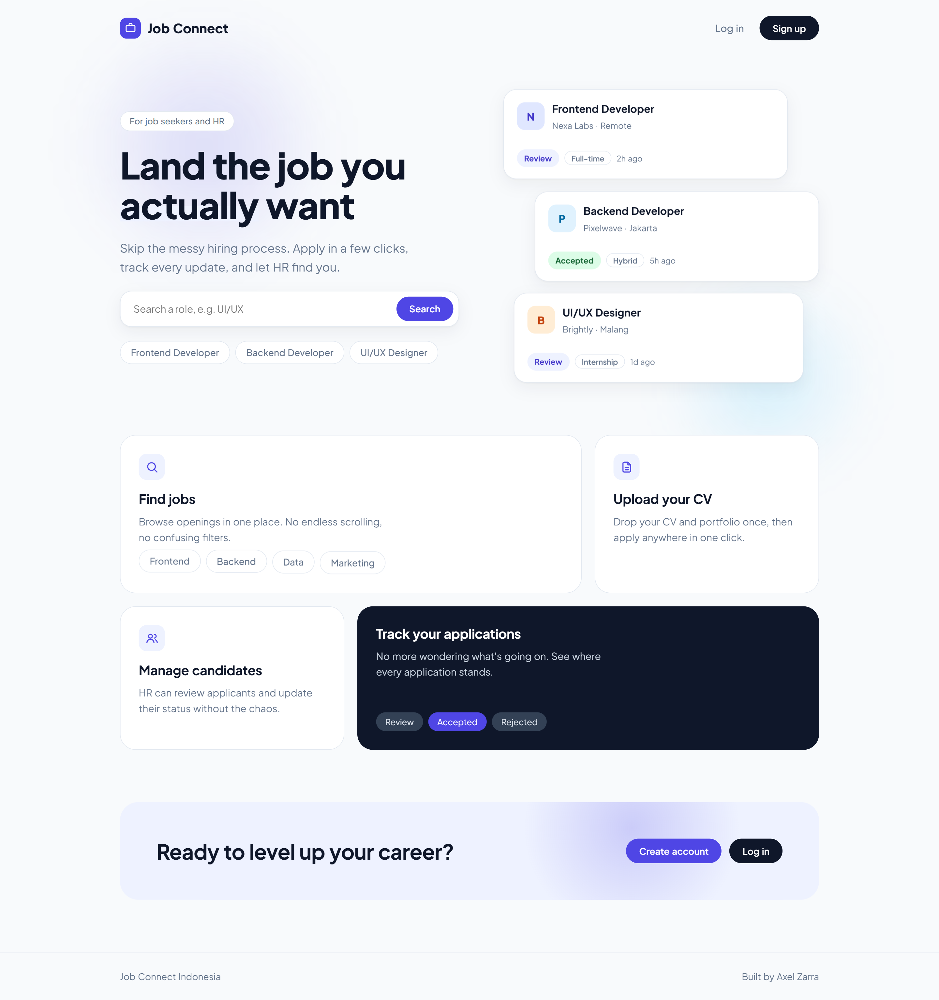
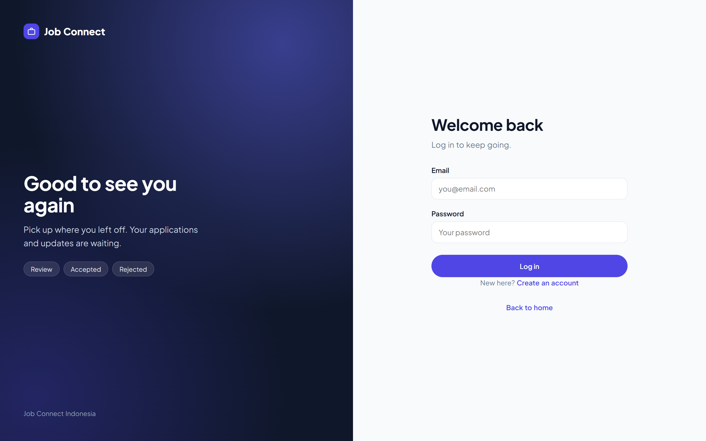
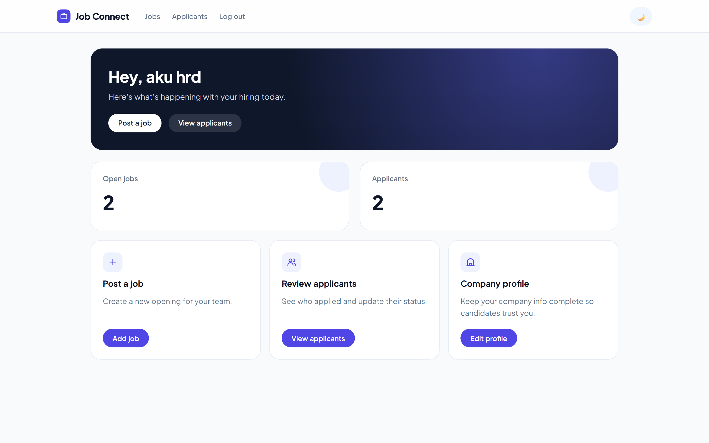
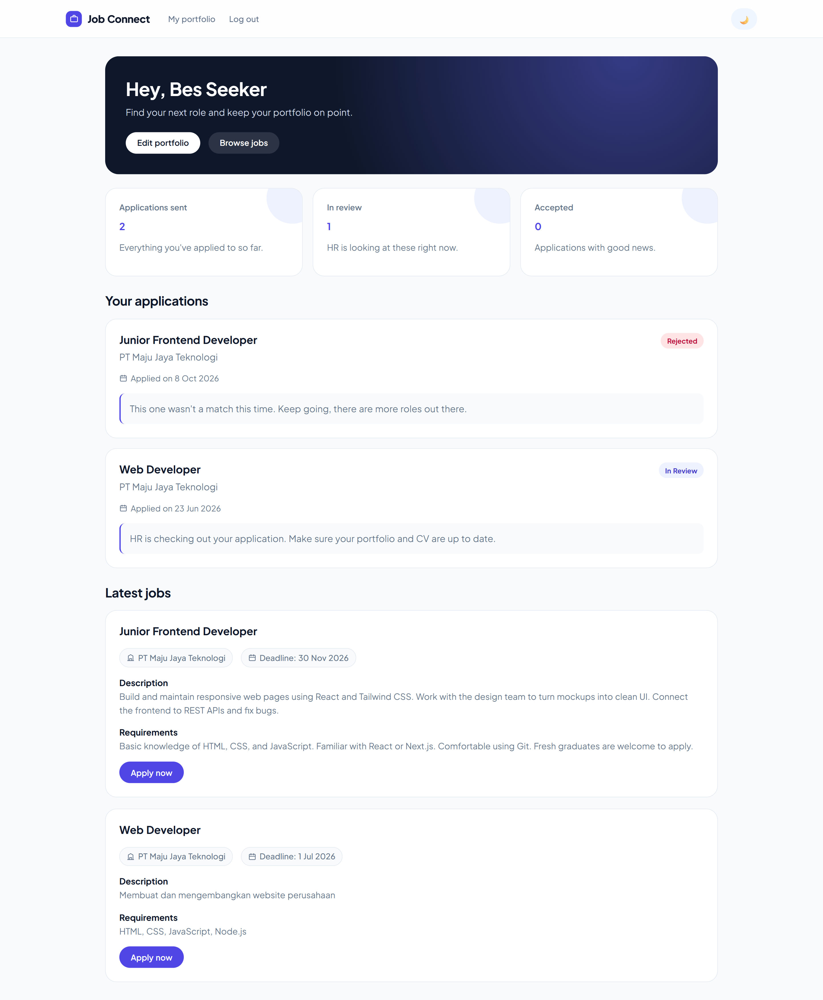

# Job Connect Indonesia

A hiring app where HR posts jobs and job seekers actually get to apply without the headache. Built with Node.js, Express, and MySQL.


## Preview

**Landing page**



**Login**



**HR dashboard**



**Job seeker dashboard**



## How it works

**Job seekers**
- Sign up, fill in your portfolio, upload your CV
- Browse openings and apply in one click (no double applications, we got you)
- Track your status: `pending`, `review`, `accepted`, `rejected`

**HR**
- Set up your company profile
- Post jobs
- See who applied and update their status

## Highlights

- Role-based access, so HR and job seekers only see their own side
- Landing page with scroll animations and micro-interactions
- Dark mode
- CV upload with Multer

## Tech stack

Node.js, Express, MySQL, EJS, plain CSS (no framework), Multer, session auth.

## Run it locally

You need Node.js and XAMPP (for MySQL).

```bash
git clone https://github.com/axelzarraa/job-connect-indonesia.git
cd job-connect-indonesia
npm install
```

1. Start **MySQL** in XAMPP
2. Create the database and tables in phpMyAdmin (`users`, `companies`, `jobs`, `applications`, `portfolios`)
3. Update your DB credentials in `config/db.js`
4. Make sure the `uploads/` folder exists
5. Run it:

```bash
node app.js
```

Open `http://localhost:3000` and you're in.

**Testing both roles?** Sessions are shared across tabs. Log in as HR in a normal window and as a job seeker in Incognito so one doesn't kick out the other.

## Why I built this

To practice full stack basics for real: auth, role-based access, table relations, file uploads, and a hiring flow from job post to final decision.

## Author

**Axel Zarra** ([@axelzarraa](https://github.com/axelzarraa))